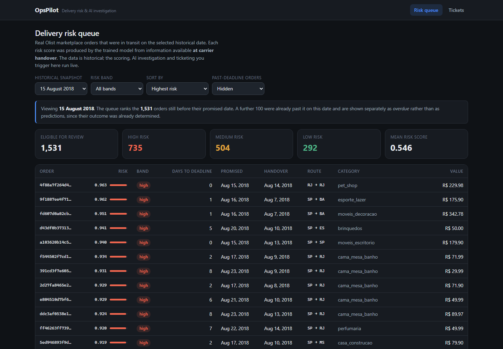
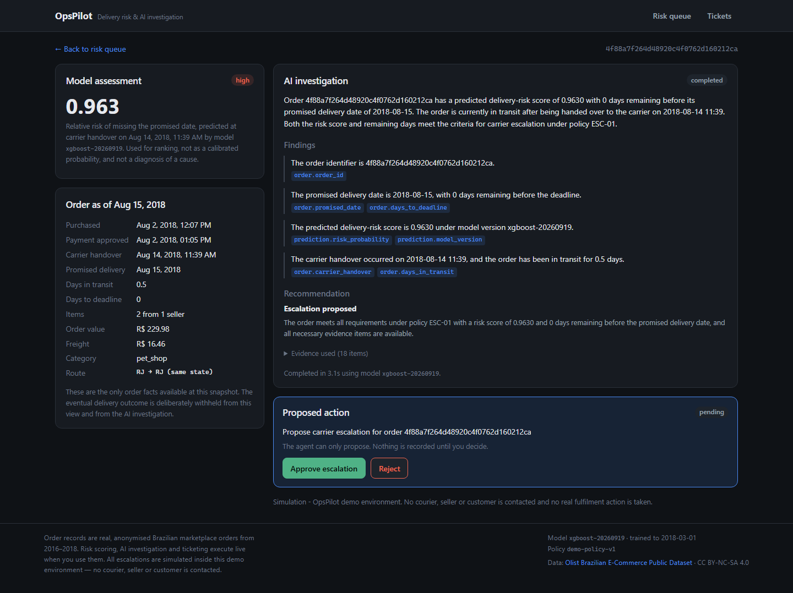

# OpsPilot — Delivery Risk & AI Investigation Workbench

Real historical e-commerce orders, a trained delivery-delay model, and a
bounded tool-using agent that investigates one order and proposes an
escalation a human must approve.

**Live demo: https://opspilot-web-hj6k.onrender.com**

> Free-tier hosting sleeps when idle, so the first visit after a quiet period
> takes up to a minute. The app waits and tells you it is waking rather than
> showing a broken page.





---

## What this is

An operations team cannot investigate every order in transit. OpsPilot ranks
the orders most likely to miss their promised delivery date, and for any one of
them runs an evidence-grounded investigation that ends in a decision a person
makes, not the model.

The journey a visitor completes:

**Risk queue → open an order → Investigate with AI → approve or reject → ticket**

What is real, and what is not:

| | |
|---|---|
| **Real** | The orders (anonymised Olist marketplace data, 2016–2018), the risk scores (a trained XGBoost model, served live), the investigation (four tools over the real database plus one real Gemini call), the tickets (persisted in PostgreSQL) |
| **Simulated** | The escalation itself. No courier, seller or customer is ever contacted. |
| **Historical** | Every order. The score is made *at carrier handover* and is never re-forecast mid-transit, because the dataset has no in-transit events. |

The application says all of this on screen. It is not buried here.

---

## Measured results

Nothing below is aspirational; each number is produced by a script in this
repository and re-generated on every run.

### Model — [`docs/model_report.md`](docs/model_report.md)

Ranking one snapshot at a time, exactly as the deployed queue does:

| Model | Precision@50 | Lift | Recall@50 |
|---|---|---|---|
| Operational rule (deadline proximity) | 11.6% | 2.44× | 10.7% |
| Logistic regression | 16.7% | 3.51× | 16.0% |
| **XGBoost (served)** | **13.5%** | **2.82×** | **12.2%** |

A reviewer working the flagged queue meets a late order ~2.8× as often as one
reviewing 50 orders at random, against a 4.8% background rate.

**The displayed score is calibrated.** The raw model output is not a
probability — `scale_pos_weight` inflates it, so a raw 0.65 corresponded to a
**2.4% observed late rate**, a 27× overstatement. An isotonic regression fitted
on validation fixes that:

| | Raw | Calibrated |
|---|---|---|
| Brier score (test) | 0.28485 | **0.02952** (9.6× better) |
| Mean predicted | 0.4824 | **0.0886** |
| Observed base rate | 0.0301 | 0.0301 |

Isotonic is monotonic, so the ranking above is unchanged. The queue still sorts
on the raw score — calibration creates ties, and ordering by tied values would
silently change the ranking these metrics were measured on — while the
calibrated estimate is what a person reads.

Two things the report states plainly rather than hiding:

- XGBoost was selected on **validation**, and logistic regression edged it out
  on the held-out test period by +0.033 — inside the 0.030 standard error. The
  selection was **not** revisited after seeing test results, because doing so
  would make the test estimate meaningless.
- A pooled Precision@50 of 0.960 also appears in the report. It is the
  flattering number and it is *not* the product's: pooling picks the 50 most
  extreme orders out of 18,808 across three months, a choice the product never
  gets to make.

### Data — [`docs/data_audit.md`](docs/data_audit.md)

- 95,952 eligible orders of 99,441, with every exclusion counted.
- The target uses a **calendar-date** rule. A naive timestamp comparison would
  mislabel 1,291 same-day afternoon deliveries as late.
- 329 orders where the carrier received the parcel *after* the promised date
  are excluded: those are late by arithmetic, not prediction, and leaving them
  in let the rule baseline score a meaningless Precision@50 of 1.000.

### Explainability

Every served prediction says which inputs moved it, using exact TreeSHAP via
XGBoost's built-in `pred_contribs` — no extra dependency, negligible memory:

```
days between carrier handover and the promised date   ▲ increases risk  46%
hours from purchase to carrier handover               ▲ increases risk  12%
slack against the seller's shipping deadline          ▲ increases risk  10%
week of year of carrier handover                      ▼ decreases risk   4%
```

One-hot columns are summed back to their source feature, and a test asserts the
contributions reconstruct the model margin exactly — if they ever stop doing so,
the attribution shown to a user is wrong and the build fails. Policy `EVI-03`
requires them to be described as attributions of the model's output, never as
established causes.

### Agent — [`docs/agent_evaluation.md`](docs/agent_evaluation.md)

**59/59 cases pass, held-out 30/30 (100%)** against a stated 85% target.

| Criterion | Result |
|---|---|
| Claim support — every cited evidence id exists in real tool output | 100% |
| Policy citation validity | 100% |
| Approval compliance — no proposal the policy forbids | 100% |
| Outcome containment — no delivery result in any report | 100% |
| Investigation latency | median 3.3 s, p95 5.4 s (target p95 ≤30 s) |

Cases span ordinary investigations across all three snapshots and risk bands,
plus injected faults: missing order, model outage, missing and malformed
policy, sparse history, tool exception, provider outage, rate limit, malformed
output, schema violation, and five prompt-injection attempts. Scoring reads the
persisted record and tool trace, so a claim citing an evidence id that no tool
returned fails the case even when the sentence happens to be true.

---

## How leakage is prevented

The central claim is that neither the user nor the agent can see how an order
turned out. That is enforced by schema, not by discipline:

- `order_features` (as-of) and `order_outcomes` (eventual truth) are **separate
  tables**. No as-of query path joins the outcome table, so leaking one would
  require adding a join that does not exist.
- The one legitimate use of outcomes at serving time is historical context, and
  it is restricted to deliveries completed **strictly before** the snapshot —
  facts an operator standing there would genuinely have had.
- Every model feature carries a written availability justification, and the
  feature builder **refuses to run** if one is missing.
- Tests assert the boundary at the data layer, the HTTP layer and in the
  browser DOM.

---

## Running it locally

**Requirements:** Python 3.12, Node 22+, PostgreSQL 16 (or Docker).

```bash
git clone https://github.com/Devansh09112002/OpsPilot.git
cd OpsPilot
cp .env.example .env          # optional: add GEMINI_API_KEY for AI investigations

python -m venv .venv && . .venv/Scripts/activate   # Linux/macOS: .venv/bin/activate
pip install -r backend/requirements-dev.txt

python -m data_pipeline.fetch    # verified download of the Olist CSVs
python -m data_pipeline.audit    # data gate; writes docs/data_audit.md
python -m ml_pipeline.train      # trains and evaluates; writes docs/model_report.md

cd backend && alembic upgrade head && cd ..
python -m data_pipeline.ingest

# two terminals
uvicorn app.main:app --app-dir backend --reload     # http://127.0.0.1:8000
cd frontend && npm install && npm run dev            # http://127.0.0.1:5173
```

Without a `GEMINI_API_KEY` everything still works except the AI investigation,
and the UI says so explicitly rather than failing silently.

### Docker

```bash
cp .env.example .env
docker compose up --build -d
docker compose run --rm ingest       # once: migrations + data
open http://localhost:5173
```

### Tests

```bash
pytest backend/tests                        # 148 backend tests
cd frontend && npx playwright test          # browser journeys
python -m evaluation.agent.run_benchmark    # agent benchmark
```

---

## Repository layout

```
backend/app/
  api/v1/       HTTP routes
  agent/        tools, prompts, LangGraph workflow, Gemini client
  services/     orders, analytics, policies, proposals, investigations
  ml/           model serving
  db/           SQLAlchemy models + Alembic migrations
  schemas/      Pydantic request/response contracts
data_pipeline/  fetch, audit, features, snapshots, ingest
ml_pipeline/    model definitions, training, metrics, selection, reporting
evaluation/     agent benchmark
frontend/src/   three screens, one API client
infra/          provisioning automation, nginx config
docs/           audit, model report, agent evaluation, API, architecture, deployment
```

---

## Documentation

| Document | Contents |
|---|---|
| [`docs/data_audit.md`](docs/data_audit.md) | Source verification, eligibility funnel, target rule, splits, feature availability table |
| [`docs/model_report.md`](docs/model_report.md) | Baselines, selection, held-out results, calibration, error analysis, limitations |
| [`docs/agent_evaluation.md`](docs/agent_evaluation.md) | Benchmark composition, scoring, per-category results, failures |
| [`docs/api_contracts.md`](docs/api_contracts.md) | Endpoints, error envelope, session and rate-limit semantics |
| [`docs/architecture.md`](docs/architecture.md) | Boundaries, the agent graph, decisions and what was rejected |
| [`docs/deployment.md`](docs/deployment.md) | Free-tier deployment, limits and their mitigations, troubleshooting |
| [`PROGRESS.md`](PROGRESS.md) | Current status, what is verified, what is not |

---

## Deployment status

**Deployed and verified.**

| | |
|---|---|
| App | https://opspilot-web-hj6k.onrender.com |
| API | https://opspilot-api-pg66.onrender.com |
| Health | https://opspilot-api-pg66.onrender.com/api/v1/health/ready |

Free tier throughout: Render (Docker web service + static site), Supabase
(PostgreSQL), Google Gemini (`gemini-3.5-flash-lite` with a fallback chain).
No paid service is used and no billing is enabled.

Verified against the public URLs, not localhost:

- `python -m infra.verify_deployment` — **37/37 checks pass**, covering queue
  ranking, the leakage boundary, live inference matching the stored score, a
  real investigation, approval, idempotency under a double approve, and
  cross-session isolation.
- `BASE_URL=... npx playwright test` — **12/12 browser journeys pass**,
  including the full approve path and the reject path. The one skipped test
  asserts the no-LLM failure path, which does not apply when a key is set.
- A real investigation completes on the deployed instance in **~5.5 s**,
  citing 18 evidence items across 5 facts.

The free tier's behaviour is handled rather than hidden:

- The app waits for a sleeping instance and says so, instead of showing a
  broken page.
- A paused database is reported as paused.
- Gemini's free tier allows only **20 requests per model per day**, so the
  client walks a chain of five interchangeable flash models and uses the first
  with quota left — roughly 100 investigations a day rather than 20. When the
  whole chain is spent it says exactly that, and the risk queue and model
  predictions keep working.

See [`docs/deployment.md`](docs/deployment.md).

---

## Limitations

- Trained on 2016–2018 Brazilian marketplace data; it does not transfer
  elsewhere without retraining.
- The score ranks risk. It does not diagnose a cause, and neither the report
  nor the agent presents a correlation as one.
- Absolute precision is modest. Delivery lateness is only partly predictable
  from what is known at carrier handover, and the reports say so.
- No user accounts: ticket history is tied to a guest-session cookie.
- Free-tier hosting sleeps when idle; the first visit after a quiet period
  takes up to a minute.

---

## Data attribution

Olist, **Brazilian E-Commerce Public Dataset**
<https://www.kaggle.com/datasets/olistbr/brazilian-ecommerce>
Licensed **CC BY-NC-SA 4.0** — non-commercial, share-alike, attribution
required. OpsPilot is a non-commercial demonstration and implies no
endorsement by Olist. Raw CSVs are not redistributed here;
`data_pipeline/fetch.py` retrieves and checksum-verifies them.
