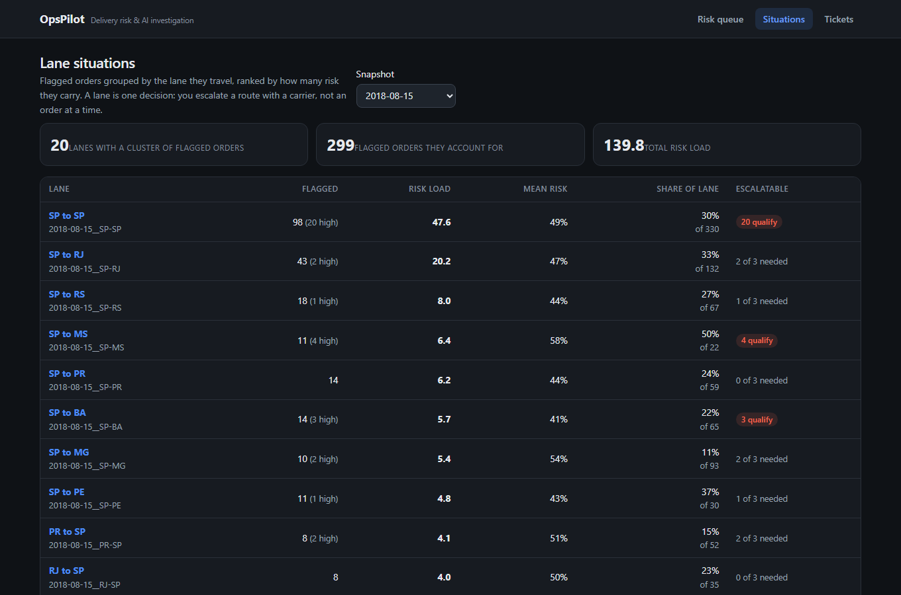
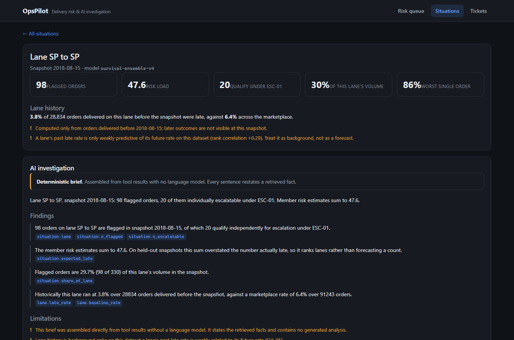
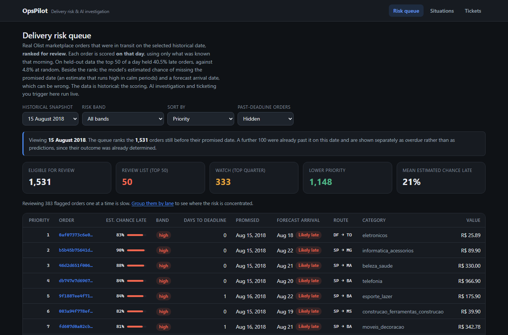
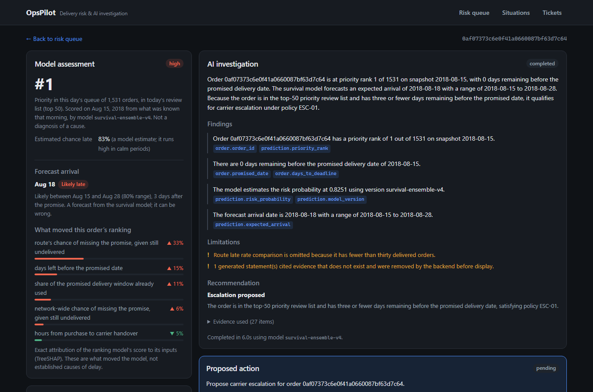

# OpsPilot — Delivery Risk & AI Investigation Workbench

Real historical e-commerce orders, a survival-analysis model that ranks the
parcels most likely to arrive late and forecasts when each will arrive, and a
bounded AI agent that investigates a risk — one order, or a whole shipping
lane — and proposes an escalation a human must approve.

**Live demo: https://opspilot-web-hj6k.onrender.com**

> Free-tier hosting sleeps when idle, so the first visit after a quiet period
> takes up to a minute. The app waits and tells you it is waking rather than
> showing a broken page.


*Flagged orders grouped by shipping lane: a lane is what you escalate to a carrier.*


*A lane assessment. Every statement carries the evidence ids it rests on, and
the backend removes any that cite evidence no tool returned.*


*The order-level priority queue the situations are built from.*


*A single-order investigation.*

---

## What this is

An operations team cannot check every parcel in transit. Each day OpsPilot
ranks all of them by their risk of missing the promised delivery date, puts
the riskiest 50 at the top as the day's review list, forecasts when each parcel
will actually arrive, and runs an evidence-grounded investigation that ends in
a decision a person makes, not the model.

The two journeys a visitor can complete:

**Risk queue → open an order → Investigate → approve or reject → ticket**

**Situations → open a lane → Investigate → approve once for every order on it → ticket**

What is real, and what is not:

| | |
|---|---|
| **Real** | The orders (anonymised Olist marketplace data, 2016–2018), the scores and forecasts (trained models, served and re-scored live), the investigation (deterministic tools over the real database plus one real Gemini call), the tickets (persisted in PostgreSQL) |
| **Simulated** | The escalation itself. No courier, seller or customer is ever contacted. |
| **Historical** | Every order. Each is scored *on the snapshot day*, using only what was known at the start of that day. |

The application says all of this on screen. It is not buried here.

---

## Results

Nothing below is aspirational; each number is produced by a script in this
repository. The test period (June–August 2018) was never used to choose a
model: choices were made by walk-forward development, the plan was written
down before testing ([`docs/preregistration_v4.md`](docs/preregistration_v4.md)),
and the test ran once.

### Finding late parcels — [`docs/research_v4.md`](docs/research_v4.md)

About 1,300 parcels are in transit on a test day; 4.8% of them end up late.

| Method | Late parcels in the day's top 50 | vs random | Late parcels caught |
|---|---|---|---|
| Random choice | 4.8% | 1.0× | — |
| Deadline rule | 11.6% | 2.4× | 10.7% |
| XGBoost classifier, same data | 21.1% | 4.4× | 20.8% |
| Kaplan–Meier survival rule | 34.9% | 7.3× | 31.2% |
| **OpsPilot (survival ensemble)** | **40.5%** | **8.5×** | **36.3%** |
| Perfect knowledge (upper limit) | 89.3% | 18.7× | 83% |

Against the XGBoost classifier trained on the same data: **+19.5 points**,
95% interval [+12.5, +25.8], better on 9 of 11 test days. Against the
Kaplan–Meier rule alone: +5.6 points, [+3.5, +7.5], 10 of 11 days.

**The order of the list matters.** In the top 10, **66%** are late, and 85%
were late or arrived within a day of the deadline; only 7% were comfortably
safe.

**It holds across very different periods.** In walk-forward development over
a calm quarter, the Black Friday peak, the March 2018 disruption and the
recovery, the ensemble averaged 57.6% against 31.4% for the XGBoost classifier,
and was ahead or tied in all four.

### Forecasting arrival

For every parcel in transit the hazard model gives the day by which 10%, 50%
and 90% of similar parcels arrive. On test, the forecast was typically off by
**2 days**, and the 80% range contained the real delivery day **87%** of the
time. The queue tags each parcel *likely late*, *tight* or *on track* from it.

### How it works

The key idea: a parcel that is **still undelivered late in its promised
window** is the strongest warning sign in this data. A model that scores each
order once, at carrier handover, cannot see it: an XGBoost classifier built that
way and trained on the same data reaches 21.1%; scoring on the snapshot day
reaches 40.5%.

Three components, combined by averaging their within-day ranks:

1. **Kaplan–Meier survival.** From recent parcels on the same lane, the
   chance one still undelivered at this age misses its promise. Parcels still
   moving are treated as *censored*, not dropped.
2. **Discrete-time hazard model (XGBoost).** The daily chance of delivery,
   learned from the order's own details and the day's congestion. Gives the
   late probability and the arrival forecast.
3. **LambdaMART.** A learning-to-rank model trained to put late parcels in the
   top 50.

Alone, no learned model beat the Kaplan–Meier rule; together they did. The
data limits how far this can go: about two-thirds of late parcels look normal a
week before their deadline, because the delay is caused by something that has
not happened yet. This public dataset has no tracking scans.

### What the numbers on screen mean

| | Meaning |
|---|---|
| **Priority** | Position in the day's queue. The validated output. |
| **Band** | `high` = the day's top 50 (the review list); `medium` = rest of the top quarter |
| **Estimated chance late** | The hazard model's estimate. It moves with network conditions and ran high on the calm test period (7.5% predicted vs 4.8% actual), so it is shown as an estimate, not used as a threshold. |
| **Forecast arrival** | A forecast with its range. It can be wrong. |

The escalation policy keys off the validated ranking: an order qualifies when
it is in the day's review list **and** three or fewer days remain.

### Explainability

Every order says which inputs moved its ranking, using exact TreeSHAP from the
ranking model, one-hot columns summed back to their source feature. Policy
`EVI-03` requires them to be described as attributions of the model's output,
never as established causes.

### Agent — [`docs/agent_evaluation.md`](docs/agent_evaluation.md)

**71 of 71 cases pass; held-out 37 of 37** against a stated 85% target,
including five prompt-injection attempts, provider outages, malformed output,
missing evidence and tool failures. Median investigation 3.8 s, p95 8.9 s.

| Criterion | Result |
|---|---|
| Claim support — every cited evidence id exists in real tool output | 100% |
| Policy citation validity | 100% |
| Approval compliance — no proposal the policy forbids | 100% |
| Outcome containment — no delivery result in any report | 100% |

Read these honestly: claim support and approval compliance are measured
*after* the backend's verification gate, so they show that the gate holds, not
that the model never errs. Injected text can influence the prose; it cannot
make an invented evidence id survive, or produce an escalation the policy
forbids, because that decision is computed in code before the model is called.

### Data — [`docs/data_audit.md`](docs/data_audit.md)

- 95,952 eligible orders of 99,441, with every exclusion counted.
- "Late" uses the **calendar date**: a naive timestamp comparison would
  mislabel 1,291 same-day afternoon deliveries.
- 329 orders handed to the carrier *after* their promised date are excluded:
  late by arithmetic, not prediction.

---

## How leakage is prevented

Neither the user, the model nor the agent can see how an order turned out.
That is enforced by structure and by tests, not by discipline:

- `order_features` (as-of) and `order_outcomes` (eventual truth) are
  **separate tables**. No as-of query path joins the outcome table.
- A snapshot-day feature may use an outcome only if it was **settled at the
  start of that day**: delivered before it, or past its promise and still
  undelivered. A test scrambles every outcome still open on the day and
  asserts that no feature moves; a negative control asserts that changing a
  settled outcome does.
- Every feature carries a written availability justification, and the
  feature builders refuse to run if one is missing.
- Tests assert the boundary at the data layer, the HTTP layer and in the
  browser DOM.

---

## Running it locally

**Requirements:** Python 3.12, Node 22+, PostgreSQL 16 (or Docker).

```bash
git clone https://github.com/Devansh09112002/OpsPilot.git
cd OpsPilot
cp .env.example .env          # optional: add GEMINI_API_KEY for AI investigations

python -m venv .venv && . .venv/Scripts/activate   # Linux/macOS: .venv/bin/activate
pip install -r backend/requirements-dev.txt

python -m data_pipeline.fetch    # verified download of the Olist CSVs
python -m data_pipeline.audit    # data gate; writes docs/data_audit.md
python -m ml_pipeline.train      # the v2 baseline model; writes docs/model_report.md

cd backend && alembic upgrade head && cd ..
python -m data_pipeline.ingest   # loads data and the served v4 scores

# two terminals
uvicorn app.main:app --app-dir backend --reload     # http://127.0.0.1:8000
cd frontend && npm install && npm run dev            # http://127.0.0.1:5173
```

The served v4 models ship in `artifacts/v4/`. To rebuild them:
`python -m ml_pipeline.train_v4` (it refuses to write models that do not
reproduce the published test result). To reproduce the research:
`python -m ml_pipeline.walkforward_v4 develop`.

Without a `GEMINI_API_KEY` everything still works except the AI investigation,
and the UI says so explicitly rather than failing silently.

### Docker

```bash
cp .env.example .env
docker compose up --build -d
docker compose run --rm ingest       # once: migrations + data
open http://localhost:5173
```

### Tests

```bash
pytest backend/tests                        # 251 backend tests
cd frontend && npx playwright test          # 34 browser journeys
python -m evaluation.agent.run_benchmark    # agent benchmark
```

---

## Repository layout

```
backend/app/
  api/v1/       HTTP routes
  agent/        tools, prompts, LangGraph workflows, Gemini client
  services/     orders, situations, analytics, policies, proposals,
                investigations, model_sync
  ml/           model serving and live re-scoring
  db/           SQLAlchemy models + Alembic migrations
  schemas/      Pydantic request/response contracts
data_pipeline/  fetch, audit, order and snapshot-day features, ingest
ml_pipeline/    survival models, walk-forward evaluation, v2 baseline
evaluation/     agent benchmark, lane calibration measurement
frontend/src/   risk queue, order detail, situations, lane detail, tickets
infra/          provisioning, deployment verification, secret scan
docs/           reports, pre-registrations, architecture, API, deployment
```

---

## Documentation

| Document | Contents |
|---|---|
| [`docs/research_v4.md`](docs/research_v4.md) | The served model: survival models, LambdaMART, ensemble, one-time test |
| [`docs/preregistration_v4.md`](docs/preregistration_v4.md) | The plan written before the test, with amendments |
| [`docs/research_v3.md`](docs/research_v3.md) | Snapshot-day scoring and the Kaplan–Meier rule |
| [`docs/agent_evaluation.md`](docs/agent_evaluation.md) | Agent benchmark composition, scoring, results |
| [`docs/data_audit.md`](docs/data_audit.md) | Source verification, eligibility funnel, target rule, feature availability |
| [`docs/model_report.md`](docs/model_report.md) | The v2 handover baseline every v4 figure is compared against |
| [`docs/snapshot_calibration.md`](docs/snapshot_calibration.md) | Whether a lane's risk load predicts the right count (it overstates by about 1.6x) |
| [`docs/architecture.md`](docs/architecture.md) | Boundaries, the models, the agent, decisions and what was rejected |
| [`docs/api_contracts.md`](docs/api_contracts.md) | Endpoints, error envelope, session and rate-limit semantics |
| [`docs/deployment.md`](docs/deployment.md) | Free-tier deployment, how a deploy updates its database, troubleshooting |

---

## Deployment

| | |
|---|---|
| App | https://opspilot-web-hj6k.onrender.com |
| API | https://opspilot-api-pg66.onrender.com |
| Health | https://opspilot-api-pg66.onrender.com/api/v1/health/ready |

Free tier throughout: Render (Docker web service + static site), Supabase
(PostgreSQL), Google Gemini (`gemini-3.5-flash-lite` with a fallback chain).
No paid service is used and no billing is enabled.

A release updates its own database: the container applies additive migrations
before serving, and the API loads the shipped model scores at start-up, so a
model change needs no manual seeding step. Verified against the public URLs
with `python -m infra.verify_deployment` and the Playwright suite.

The free tier's behaviour is handled rather than hidden:

- The app waits for a sleeping instance and says so, instead of showing a
  broken page.
- A paused database is reported as paused.
- Gemini's free tier allows only **20 requests per model per day**, so the
  client walks a chain of five interchangeable flash models — roughly 100
  investigations a day. Deterministic lane briefs need no AI call at all and
  do not count against the shared cap.

---

## Limitations

- Trained on 2016–2018 Brazilian marketplace data; it does not transfer
  elsewhere without retraining.
- **The ranking is validated; the probability is an estimate.** It moves with
  network conditions and ran high on the calm test period. A lane's *risk
  load* (the sum of those estimates) overstated the actual late count by about
  1.6x on held-out snapshots; it is for comparing lanes (rank correlation
  0.64), not for counting.
- About two-thirds of late parcels look normal a week before their deadline:
  the delay has not happened yet. The data has no tracking scans, which caps
  how far any model can go (perfect knowledge would reach 89% in the top 50).
- The test period was used twice (v3, then v4), disclosed in both
  pre-registrations; v4 had to clear a stricter bar to be tested at all.
- The score ranks risk. It does not diagnose a cause.
- No user accounts: ticket history is tied to a guest-session cookie.
- Free-tier hosting sleeps when idle; the first visit after a quiet period
  takes up to a minute.

---

## Licence

Source code: **MIT** — see [`LICENSE`](LICENSE).
Third-party data terms: see [`NOTICE`](NOTICE).

The Olist dataset is **not** MIT and is not redistributed here; it is fetched
at build time and carries CC BY-NC-SA 4.0 (non-commercial). The trained
artefacts in `artifacts/` are derived from it and inherit those terms, as
stated in `NOTICE`.

---

## Data attribution

Olist, **Brazilian E-Commerce Public Dataset**
<https://www.kaggle.com/datasets/olistbr/brazilian-ecommerce>
Licensed **CC BY-NC-SA 4.0** — non-commercial, share-alike, attribution
required. OpsPilot is a non-commercial demonstration and implies no
endorsement by Olist. Raw CSVs are not redistributed here;
`data_pipeline/fetch.py` retrieves and checksum-verifies them.
